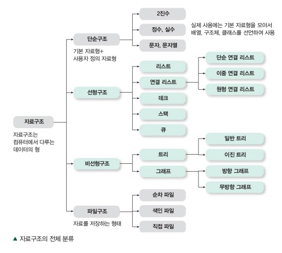

# 자료구조

자료구조는 데이터 값의 모임 또는 데이터에 적용할 수 있는 함수나 명령을 의미한다. 

어떤 자료구조를 사용하는지에 따라 프로그램의 효율성이 달라진다.

## 특징
### 효율성
자료구조를 사용하는 목적은 메모리를 효율적으로 사용하고, 데이터를 효율적으로 사용 및 관리하는 것이다. 

### 추상화
복잡한 자료, 모듈, 시스템 등으로부터 핵심적인 개념을 간추려 내는 것이다.

자료구조로 데이터를 처리할 때에는 **어느 시점**에 데이터를 삽입할 것인지, **어느 시점**에 데이터를 추출하고 어떻게 사용할 것인지에 초점을 둔다. 자료구조의 내부 구현보단 어떻게 사용해야하는지를 알면 된다. 

### 재사용성
자료구조를 설계할 때 특정 프로그램에서만 동작하게 설계하지 않는다. 

다양한 프로그램에서 범용성있게 동작하도록 설계하기 때문에 다른 프로젝트에서도 사용할 수 있다. 

## 종류

### 선형 구조
데이터를 순차적으로 나열시킨 형태이다.

자료들 간의 앞뒤 관계가 1:1이다.

- 배열(Array)

- [연결 리스트(Linked List)](/Data-Structure/Linked-List.md)

- [스택(Stack)](/Data-Structure/Stack.md)

- 큐(Queue)

- 덱(Deque)

### 비선형 구조
하나의 자료 뒤에 여러 개의 자료가 존재할 수 있는 형태이다.

자료들 간의 앞뒤 관계가 1:n 또는 n:n이다. 

- 트리(Tree)

- 그래프(Graph)

## See Also

https://en.wikipedia.org/wiki/Data_structure