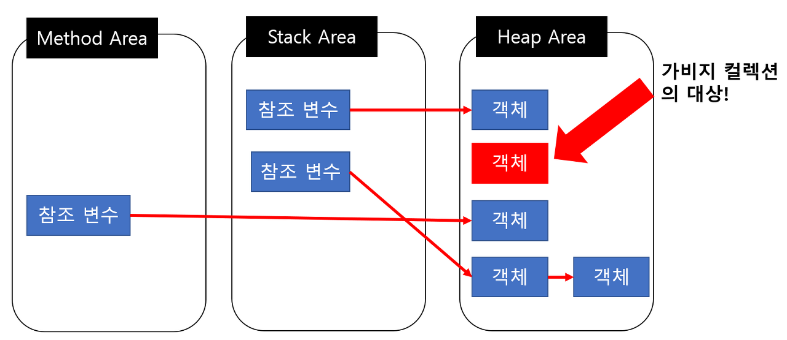
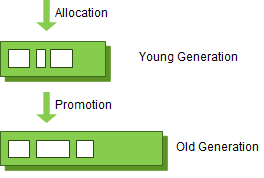

# 가비지 컬렉션(GC, Garbage Collection)

메모리 관리 방법 중 하나로 프로그램이 동적으로 할당했던 메모리 영역 중에서 필요없게 된 메모리 영역을 해제하는 기능이다. 

여기서 필요없게 된 메모리 영역은 어떤 변수도 가리키지 않게 된 영역을 의미한다.

## 장점

쓰레기 수집이 지원되는 환경에서는 개발자가 관리하지 않아도 된다. 쓰레기 수집은 아래와 같은 버그를 줄이거나 막을 수 있다.

- 유효하지 않은 포인터 접근 : 이미 해제된 메모리에 접근하는 버그
- 이중 해제 : 이미 해제된 메모리를 또다시 해제하는 버그
- 메모리 누수 : 더이상 필요하지 않은 메모리가 해제되지 않고 남아 있는 버그. 메모리 누수가 반복되면 메모리 고갈로 프로그램이 중단될 수 있다.

## 단점

- 어떤 메모리를 해제할지 결정하는 데에 비용이 든다. 메모리 해제 시점을 추적해야 하므로 이것은 오버헤드가 된다.
- 가비지가 수집되는 타이밍을 예측할 수 없다.
- 할당된 메모리가 해제되는 시점을 알 수 없다. 

## 가비지 컬렉션 대상

가비지 컬렉션은 특정 객체가 가비지인지 아닌지 판단한기 위해 도달능력(Reachability)이라는 개념을 적용한다.

객체에 레퍼런스가 있으면 Reachable로 구분하고, 객체에 유효한 레퍼런스가 없다면 Unreachable로 구분한다.

- Reachable : 객체가 참조되고 있는 상태
- Unreachable : 객체가 참조되고 있지 않은 상태 (GC의 대상이 됨)

## 전제 조건 (Weak Generational Hypothesis)

- 대부분의 객체는 금방 불가능한 상태(Unreachable)가 된다.
- 오래된 객체에서 새로운 객체로의 참조는 아주 적게 존재한다.

객체는 대부분 일회성이며 메모리에 오랫동안 남아있는 경우는 드물다. 

그렇기 때문에 객체의 생존 기간에 따라 물리적인 Heap 영역을 Young, Old 2가지 영역으로 설계되었다.

- **Young Generation**
  - 새롭게 생성된 객체가 할당되는 영역
  - 대부분의 객체가 금방 Unreachable 상태가 되기 때문에 많은 객체가 Young 영역에 생성되었다가 사라진다.
  - Young 영역에 대한 가비지 컬렉션을 Minor GC라고 부른다.
- **Old Generation**
  - Young 영역에서 Reachable 상태를 유지해서 살아남은 객체가 복사되는 영역
  - Young 영역보다 크게 할당되고, 영역 크기가 큰 만큼 가비지는 적게 발생한다.
    - 수명이 짧은 Young 영역의 객체들은 큰 공간이 필요없다.
  - Old 영역에 대한 가비지 컬렉션을 Major GC 혹은 Full GC라고 부른다.

## 방식

Young 영역과 Old 영역은 서로 다른 메모리 구조로 되어 있기 때문에 세부 동작은 다르지만, 아래 2가지 공통적인 단계를 따른다.

### Stop The World

- JVM이 애플리케이션의 실행을 멈추는 작업
- GC를 실행하는 쓰레드를 제외한 모든 쓰레드들의 작업이 중단되고, GC가 완료되면 작업이 재개된다.
- 일반적으로 GC의 성능 개선은 stop the world의 시간을 줄이는 작업이라고 보면 된다.

### Mark and Sweep

- Mark : 사용되는 메모리와 사용되지 않는 메모리를 식별하는 작업
  - 스택의 모든 변수, Reachable 객체를 스캔하면서 각각이 어떤 객체를 참고하고 있는지 탐색한다.
- Sweep : Mark 단계에서 사용되지 않음으로 식별된 메모리를 해제하는 작업