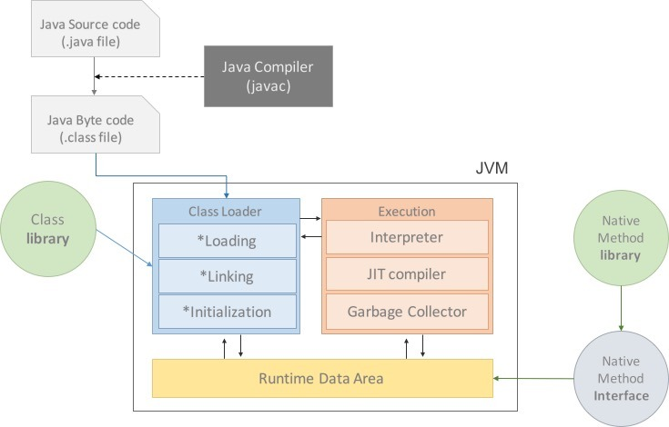

# Java Virtual Machine (JVM)
- JVM은 Java가 OS에 구애받지 않고 실행할 수 있게 해주는 자바 가상 머신이다.
- OS를 대신하여 컴파일 된 Java 바이트 코드(.class)를 실행하는 가상 운영체제 역할을 하기 때문에 Java는 플랫폼에 의존적이지 않다.
  > .class 파일은 사람이 쓰는 자바 코드에서 컴퓨터가 읽는 기계어
- 하지만 JVM은 플랫폼에 의존적이기 때문에 OS에 맞는 JVM을 설치해야 한다.

## 특징

- 스택 기반의 가상 머신
- 심볼릭 레퍼런스
- 가비지 컬렉션(GC)
- 기본 자료형을 명확하게 정의하여 플랫폼 독립성 보장

## 실행과정

1. 프로그램이 실행되면 JVM은 OS로부터 이 프로그램이 필요로 하는 메모리를 할당받는다.
   - JVM은 이 메모리를 용도에 따라 여러 영역으로 나누어 관리한다.
2. 자바 컴파일러(javac)가 자바 소스코드(.java)를 읽어들여 자바 바이트코드(.class)로 변환시킨다.
3. Class Loader를 통해 class 파일들을 JVM으로 로딩한다.
4. 로딩된 class 파일들은 Execution engine을 통해 해석된다.
5. 해석된 바이트 코드는 Runtime Data Areas에 배치되어 실질적인 수행이 이루어지게 된다.
6. 이러한 실행과정 속에서 JVM은 필요에 따라 Thread Synchronization과 GC같은 관리작업을 수행한다.

## 구조
### 클래스 로더 (Class Loader)

바이트 코드를 읽어오며 메모리에 적절히 배치하는 역할

- 로딩
  - .class를 읽어온다
- 링크
  - 코드 내부의 레퍼런스를 연결함
- 초기화
  - 클래스에 있는 static 값들을 초기화 함

### 실행 엔진 (Execution Engine)
- 인터프리터
  - 바이트 코드를 한줄씩 읽어 네이티브 코드로 변환
- JIT (Just In Time) 컴파일러
  - 바이트 코드에서 반복되는 코드 부분은 JIT 컴파일러가 미리 네이티브 코드로 변환 시켜놓음
  - 반복되는 코드가 읽힐 순서가 왔을 때, 인터프리터로 읽지 않고 바로 네이티브 코드를 바로 사용
  - 인터프리터 읽을 때의 속도 효율성을 JIT 컴파일러가 보완하는 형태
- GC (Garbage Collector)
  - 더 이상 참조되지 않는 객체를 모아서 메모리 정리
  - 경우에 따라 성능 효율을 위해 커스터마이징을 해야한다

### 메모리 영역 (Memory Areas)
모든 쓰레드가 공유하는 영역으로 JVM이 시작될 때 생성된다.

- 메소드
  - 클래스 수준의 정보를 저장
  - 클래스 이름, 부모 클래스 이름, 메소드, 변수 등
  - static 변수, 일반 변수 등
- 힙
  - 모든 쓰레드가 공유하는 영역
  - 프로그램을 실행하면서 생성된 모든 인스턴스 또는 객체를 저장하는 공간
- 스택
  - 인스턴스 및 지역 변수의 참조 주소들을 저장
  - 쓰레드마다 런타임 스택을 만드록, 스택 프레임을 쌓음
  - 에러 났을 때, 에러 메시지를 보면 런타임 스택에 메시지가 쌓여있는걸 확인할 수 있음
- PC
  - 쓰레드마다 가지고 있는 Program Counter
  - 현재 실행할 부분을 가르키고 있다
- Native method stack
  - 네이티브(native) 메소드 호출할 때 사용하는 별도의 스택
  - 자바 바이트 코드가 아닌 다른 언어로 작성된 네이티브 코드를 위한 스택

## Reference

https://asfirstalways.tistory.com/158

https://coding-factory.tistory.com/827