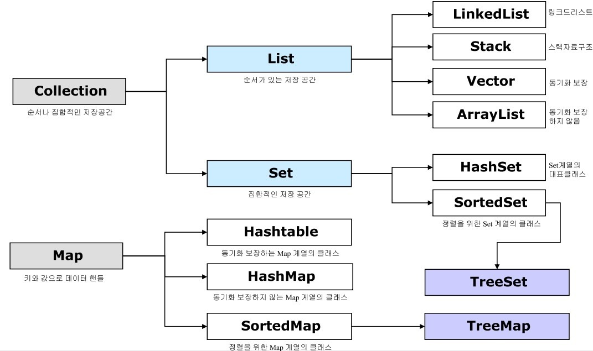

# 자바 컬렉션 프레임 워크 (JCF)
데이터를 저장하는 자료구조와 데이터를 처리하는 알고리즘을 구조화하여 클래스로 구현한 것이다.

크게 List, Set, Map으로 구분할 수 있다.

## 특징

인터페이스 | 특징 | 구현 클래스
-|-|-
List| 순서가 있는 데이터의 집합. 데이터의 중복을 허용 | [LinkedList](/Data-Structure/Linked-List.md), Stack, Vector, ArrayList
Set | 순서가 없는 데이터의 집합. 데이터의 중복 비허용  | HashSet, TreeSet 
Map | 키와 값의 한 쌍으로 이루어지는 데이터의 집합으로 순서가 없다. 키는 중복 비허용, 값은 허용 | HashMap, TreeMap, HashTable, Properties
