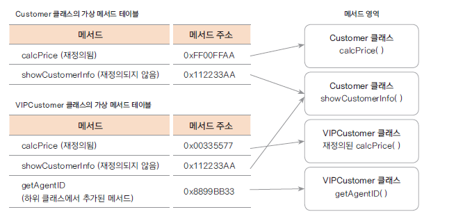

# Java Programming

- 자바프로그래밍입문(박종은, 이지퍼블리싱)
- OS : ubuntu

## 목차

[시작](#시작)

[변수와 자료형](#변수와-자료형)

[클래스와 객체](#클래스와-객체)

[상속과 다형성](#상속과-다형성)

[추상 클래스](#추상-클래스)

[인터페이스](#인터페이스)

[기본 클래스](#기본-클래스)

[컬렉션 프레임워크](#컬렉션-프레임워크)

[내부 클래스, 람다식, 스트림](#내부-클래스-람다식-스트림)

[예외 처리](#예외-처리)

[자바 입출력](#자바-입출력)

## 시작
- 프로그램 : 컴퓨터에게 일을 시키는 명령의 집합
- 컴파일(compile) : 컴퓨터가 이해할 수 있는 언어(기계어)로 번역하는 것
    - 사람이 이해하기 쉬울수록 고급 언어, 컴퓨터가 이해하기 쉬울수록 저급 언어

### 자바를 사용하는 이유

- **플랫폼에 영향을 받지 않으므로 다양한 환경에서 사용할 수 있다**
   - 플랫폼(platform) : 프로그램이 실행되는 환경
   - 자바에서 파일을 만들고 컴파일하면 `.class`파일이 생성된다. 이 파일은 바이트 코드라고 하는데 완벽한 실행 파일이 아니므로 [자바 가상 머신(JVM)](/Java/JVM.md)이 필요하다.
 - **객체 지향 언어이므로 유지보수가 쉽고 확장성이 좋다**
   - 객체 지향 프로그래밍 : 여러 객체의 협력을 통해 프로그램을 구현하는 것
 - **프로그램이 안정적이다**
   - 동적 메모리 수거를 프로그래머가 하지 않고 [가비지 컬렉터(GC)](/Java/Garbage-Collection.md)를 이용하므로 메모리를 효율적으로 관리할 수 있다.
 - **풍부한 기능을 제공하는 오픈 소스이다**
   - 자료 구조, 네트워크, 입출력, 예외 처리 등에 최적화된 알고리즘 라이브러리를 제공하는 자바 개발 키드(JDK)가 있다.

<details>
<summary><b>개발 환경 설치</b></summary>
<div markdown="1">

1. 설치
```bash
sudo apt-get update
sudo apt-get upgrade

# Java11 설치
sudo apt-get install openjdk-11-jdk
```

2. 설치 확인
```bash
# 설치 확인
java -version
openjdk version "11.0.22" 2024-01-16
OpenJDK Runtime Environment (build 11.0.22+7-post-Ubuntu-0ubuntu222.04.1)
OpenJDK 64-Bit Server VM (build 11.0.22+7-post-Ubuntu-0ubuntu222.04.1, mixed mode, sharing)

# 설치 확인
javac -version
javac 11.0.22
```

3. 환경설정
```bash
# ~/.profile 열기
$ sudo gedit ~/.profile

# ~/.profile 파일에 설정 추가
# JAVA_HOME settings
export JAVA_HOME=$(dirname $(dirname $(readlink -f $(which java))))
export PATH=$PATH:$JAVA_HOME/bin

# 현재 실행중인 shell에 즉시 적용
$ source ~/.profile

# 설정 확인
$ echo $JAVA_HOME
/usr/lib/jvm/java-11-openjdk-am64
```

4. Java 삭제 (필요한 경우)
```bash
sudo apt-get purge openjdk*
```

</div>
</details>

## 변수와 자료형

### 컴퓨터의 데이터 표현

- **비트(bit)** : 0 또는 1로 표현할 수 있는 최소 단위
- **바이트(byte)** : 8비트가 모이면 1바이트

컴퓨터 내부에서는 데이터를 0과 1로 이루어진 2진수로 표현해야한다. 프로그램에서 2진수를 사용할 때는 숫자 앞에 0B, 8진수는 0, 16진수는 0X를 붙인다. 

- **부호비트(Most Significant Bit; MSB)** : 맨 앞에 붙이는 부호를 나타내는 비트. 0이면 양수, 1이면 음수
- **2의 보수** : 보수는 보충해주는 수. 2의 보수는 어떤 특정한 10진수 n이 있을 때 3에 대한 n의 보수라고 하면 3과 어떤 수를 합하여 n이 되는 수
    - 2진수에서 2의 보수는 더하여 2, 즉 10이 되는 수. 즉 맨 왼쪽 한 비트가 1로 증가하고 나머지는 0이 된다.
    - 4비트 컴퓨터이므로 맨 앞의 1비트가 사라지는데 이를 '트렁게이트(truncate)'라고 한다.

### 변수

- 변하는 값
- **변수의 자료형** : 변수를 사용하기 위해서는 어떤 형태의 자료를 저장할 것인지 정해야 한다. 이때 저장하는 형태
- **변수 선언** : 자료형을 지정한 후, 이름을 정하는 것
- `=` : 프로그램에서는 '오른쪽 값을 왼쪽에 대입한다'는 의미
- **초기화** : 변수에 처음 값을 대입하는 것
- **이름 제약 사항**
  - 영문자(대문자, 소문자)나 숫자를 사용할 수 있고, 특수 문자에서는 `$`, `_`만 사용 가능
  - 숫자로 시작 불가
  - 이미 사용 중인 예약어는 사용 불가
- 변수 이름은 대부분 소문자로 시작하며 중간에 다른 뜻의 단어가 등장할 때 첫 글자를 대문자로 사용하는 것은 '**카멜 표기법(camel notation)**'이라고 한다.

### 자료형

- 변수는 컴퓨터 내부의 메모리 공간에 저장된다.
- 자바에서 제공하는 자료형 : **기본 자료형, 참조 자료형**
  - 기본 자료형 : 자바 라이브러리에서 기본으로 제공하며, 메모리가 제한되어있다.

***기본 자료형의 종류***

.|정수형|문자형|실수형|논리형|정수형 수의 범위
-|-|-|-|-|-
1바이트|byte|||boolean|byte / -2<sup>7</sup>~2<sup>7</sup>-1
2바이트|short|char|||short / -2<sup>15</sup>~2<sup>15</sup>-1
4바이트|int||float||int / -2<sup>31</sup>~2<sup>31</sup>-1
8바이트|long||double||long / -2<sup>63</sup>~2<sup>63</sup>-1

***정수 자료형***

- **byte형** : 바이트 단위의 정보를 저장하거나 통신할 때 주로 사용. 동영상이나 음악 파일을 재생할 때 또는 네트워크로 데이터를 전송할 때 사용한다.
- **short형** : 정수를 표현하는 자료형
- **int형** : 가장 많이 사용하는 자료형. 이유는 컴퓨터에서 정수로 연산할 때 4바이트 단위로 처리하는 것이 효율적이다. 자바에서는 모든 정수 값을 int형을 기본으로 처리한다.
- **long형** : 정수를 표현하는 가장 큰 단위의 자료형
  - long을 나타내는 식별자인 L이나 l을 숫자 뒤에 붙여야한다.
  - 범위 내부에 있는 값을 사용할 때는 식별자가 필요없다.

***문자 자료형***

- **문자 세트** : 어떤 문자를 컴퓨터 내부에서 표현하기 위해 특정 정수 값으로 정한 것을 모아둔 것
- **인코딩(encoding)** : 문자를 정해진 코드 값으로 변환하는 것
  - **아스키(ASCII)코드** : 가장 기본이 되는 문자 인코딩. 영문자, 숫자, 특수 문자 등을 나타내는 문자 세트이다. 1바이트만 사용하며, 한글이나 다른 언어 문자는 표현하기 어렵다. 
  - **유니코드(unicode)** : 아스키에서 표현하기 어려운 문자를 2바이트 이상을 사용하는데 이 때 각 언어의 표준 인코딩을 정의해놓은 것. 
- **문자 디코딩(decoding)** : 코드 값을 다시 문자로 변환하는 것
- 자바는 유니코드에 기반하여 문자를 표현하기 때문에, 문자 자료형인 char형은 2바이트를 사용한다.
- 문자를 사용할 때는 `'`, 문자열을 사용할 때는 `"`사용
  - 문자열 끝에는 항상 널 문자`\0`가 있다. 널 문자는 문자열의 끝을 나타낸다.

> **자바는 UTF-16 인코딩을 사용**
>
> 자바의 기본 인코딩은 모든 문자를 2바이트로 표현하는 UTF-16이다. 하지만 1바이트로 표현 가능한 알파벳 같은 자료를 저장할 경우, 메모리가 낭비될 수 있다. 그에 비해 UTF-8을 사용하면 메모리 낭비가 적고, 전송 속도가 빠르다. 

***실수 자료형***

- **부동 소수점 방식** : 실수와 표현 방식이 다르며, 지수와 가수를 구분해서 표현하는 방식. 더 많은 실수를 세밀하게 표현할 수 있다.
- **float형** : 부호 1비트, 지수부 8비트, 가수부 23비트로 총 32비트
  - 숫자 뒤에 F또는 f를 붙여 식별해야 한다.
- **double형** : 부호 1비트, 지수부 11비트, 가수부 52비트로 총 64비트
  - 자바에서 실수는 double형을 기본으로 사용한다. 

***논리 자료형***

**boolean형** : 1바이트로 값을 저장한다. true, false 두 가지 값만 가진다.

### 상수와 리터럴

- **상수(constant)** : 항상 변하지 않는 값. `final` 예약어를 사용한다.
  - 이름은 `대문자`를 주로 사용하고, 여러 단어를 연결하는 경우엔 `_` 기호를 사용한다.
  - 프로그램 내부에서 반복적으로 사용하거나 변하지 않아야 하는 값을 상수로 선언하는 것이 좋다.
- **리터럴(literal)** : 프로그램에서 사용하는 모든 숫자, 문자, 논리값을 일컫는 말이다. 즉 변수나 상수에 댕비되는 문자 또는 숫자를 `리터럴`또는 `리터럴 상수`라고 한다.
  - 프로그램이 시작할 때 시스템에 같이 로딩되어 특정 메모리 공간인 상수 풀(constant pool)에 놓인다. 변수에 대입되는 값을 메모리에 저장해 두었다가 변수를 호출할 때 값을 변수 메모리에 복사하는 것

### 형 변환

- **형 변환(type conversion)** : 각 변수의 자료형이 다를 때 자료형을 같게 바꾸는 것
  - 크게 묵시적 형 변환(자동 형 변환)과 명시적 형 변환(강제 형 변환)으로 나뉜다.

***형 변환 기본 원칙***

1. 바이트 크기가 작은 자료형에서 큰 자료형으로 형 변환은 자동으로 이루어진다.
2. 덜 정밀한 자료형에서 더 정밀한 자료형으로 형 변환은 자동으로 이루어진다.
   
## 클래스와 객체

### 객체 지향 프로그래밍(Object-Oriented Programming; OOP)

- 프로그래밍에서 필요한 데이터를 추상화 시켜 상태와 행위를 가진 객체로 만들고, 객체들간의 상호작용을 통해 로직을 구성하는 프로그래밍 방법이다.
- **장점**
  - 프로그램을 유연하고 변경하기 쉽게 만들기 때문에 대규모 소프트웨어 개발에 많이 사용된다.
  - 소프트웨어 개발과 보수를 간편하게 한다.
  - 직관적인 코드 분석을 가능하게 한다.
- **특징**
  - `추상화` : 불필요한 정보는 숨기고 중요한 정보만을 표현함으로써 프로그램을 간단하게 만드는 것
  - `캡슐화` : 데이터 구조와 데이터를 다루는 방법들을 결합 시켜 묶는 것
    - 속성과 기능을 정의하는 변수와 메소드를 클래스라는 캡슐에 넣어서 분류하는 것으로 재활용이 원활하다는 장점이 있고 캡슐화를 통해서 정보은닉을 활용 할 수도 있다.
  - `상속` : 새로운 클래스가 기존의 클래스의 데이터와 연산을 이용할 수 있게 하는 기능
  - `다형성` : 어떠한 요소에 여러 개념을 넣어 놓는 것
    - **오버라이딩** : 상위 클래스가 가지고 있는 메소드를 하위 클래스가 재정의해서 사용하는 것
    - **오버로딩** : 같은 이름의 메서드가 인자의 개수나 자료형에 따라 다른 기능을 하는 것

### 객체 지향 설계 5원칙 - SOLID

소프트웨어를 설계함에 있어 이해하기 쉽고, 유연하며, 유지보수 및 확장이 편하다는 장점이 있다.

- `SRP(Single Responsibility Principle)` : 단일 책임 원칙
- `OCP(Open Closed Priciple)` : 개방 폐쇄 원칙
- `LSP(Liskov Substitution Priciple)` : 리스코프 치환 원칙
- `ISP(Interface Sergregation Priciple)` : 인터페이스 분리 원칙
- `DIP(Dependency Inversion Priciple)` : 의존 역전 원칙

**1. SRP(Single Responsibility Principle) 단일 책임 원칙**

> 한 클래스는 하나의 책임만 가져야 한다.

- 여기서 하나의 책임의 기준은 '**변경**'을 말한다. SRP 원칙을 적용하면 다른 클래스들이 서로 영향을 미치는 연쇄작용을 줄일 수 있다. 즉, 응집도는 높이고 결합도는 낮출 수 있다.

- 책임을 적절하게 분배하면 코드의 가독성 향상, 유지보수 용이라는 이점을 가질 수 있다.

- 예를 들어 결제 클래스가 있다면 이 클래스는 오직 결제 기능만 책임지고, 이 클래스를 수정해야 한다면 결제에 관련된 문제뿐 이어야한다.

**2. OCP(OPen Closed Priciple) : 개방 폐쇄 원칙**

> 소프트웨어 요소는 확장에는 열려있으나 변경에는 닫혀 있어야 한다.

- **기존의 코드는 변경하지 않으면서 기능을 추가할 수 있도록 설계가 되는 원칙**을 말한다.

- 예를 들어 캐릭터 하나를 생성한다고 할 때 각 캐릭터마다 움직임이 다를 경우, 움직임 패턴 구현을 하위 클래스에 맡긴다면 캐릭터 클래스의 수정은 필요없고(Closed), 움직임 패턴만 재정의 하면 된다.(Open)

- 클래스를 설계할 때 변하는 부분과 변하지 않는 부분을 명확히 구분해야 한다. 변할 수 있는 부분은 추상화하여 상속하는 클래스가 의존할 수 있게 코드를 작성한다.

- 개방-폐쇄 원칙을 적용하기 위한 중요한 메커니즘은 **추상화**와 **다형성**이다.

**3. LSP(Liskov Substitution Priciple) : 리스코프 치환 원칙**

> 서브 타입은 언제나 자신의 기반 타입으로 변경할 수 있어야 한다.

- 상위 타입을 하위 타입으로 대체하여도 문제가 없어야 한다.


리스코프 치환 원칙 위배


리스코프 치환 원칙 준수

- 리스코프 치환 원칙은 **다형성**과 **확장성**을 극대화하며, 개방-폐쇄 원칙을 구성한다.

**4. ISP(Interface Sergregation Priciple) : 인터페이스 분리 원칙**

> 하나의 일반적인 인터페이스보다 여러 개의 구체적인 인터페이스가 낫다.

- 인터페이스를 가능한 **최소한의 기능만 제공하면서 하나의 역할에 집중하라는 뜻**이다.
  
- SRP가 클래스의 단일 책임을 강조했다면 ISP는 **인터페이스의 단일책임**을 강조한다.

**5. DIP(Dependency Inversion Priciple) : 의존 역전 원칙**

> 구체적인 것이 추상화된 것에 의존해야 한다. 자주 변경되는 구체 클래스에 의존하지마라.

- 상위 클래스, 인터페이스, 추상 클래스일수록 변하지 않을 가능성이 크다. **의존 관계를 맺을 때 거의 변화가 없는 것에 의존하라는 것**이다.


의존관계 역전 원칙 위배


의존관계 역전 원칙 준수

- **의존성 주입(DI; Dependency Injection)**을 활용하면 DIP 원칙을 따르는 것이다.

***주요 용어***
용어|설명
-|-
객체|객체 지향 프로그램의 대상, 생성된 인스턴스
클래스|객체를 프로그래밍하기 위해 코드로 만든 상태
인스턴스|클래스가 메모리에 생성된 상태
멤버 변수|클래스의 속성, 특성
메서드|멤버 변수를 이용하여 클래스의 기능을 구현
참조 변수|메모리에 생성된 인스턴스를 가리키는 변수
참조 값|생성된 인스턴스의 메모리 주소 값

> 코딩 컨벤션(onding convension) : 코딩을 할 때 읽기 쉽고 이해하기 쉽도록 정한 규칙

### 메서드

함수의 한 종류로, 다른 언어에서는 보통 함수라고 표현하지만 java에서는 method라고 한다.

- **함수(function)** : 하나의 기능을 수행하는 일련의 코드
  - 정의된 함수는 호출하여 사용하고, 호출된 함수는 기능이 끝나면 값을 return(반환)된다.
  - **장점**
    - 기능을 나누어 코드를 효율적으로 구현할 수 있다.
    - 기능별로 구현했을 때 같은 기능을 언제든 다시 사용할 수 있다.
    - 디버깅 작업을 할 때도 편리하다.
  - 함수를 호출하면 해당 함수만을 위한 메모리 공간이 할당되는데, 이 메모리 공간을 [스택(stack)](/Data-Structure/Stack.md)이라고 한다.

### 인스턴스

- 클래스가 메모리 공간에 생성된 상태를 말한다.
- 지역 변수는 스택에 생성되고, 인스턴스는 `힙 메모리`에 생성된다.
  - **힙 메모리(heap memory)** : 객체가 생성될 때 사용되는 공간은 힙이다. 힙은 동적으로 할당되며 사용이 끝나면 메모리를 해제해야하는데 자바에서는 가비지 컬렉터가 자동으로 메모리를 해제해준다.
  - 힙 메모리에 생성된 인스턴스의 메모리 주소는 참조 변수에 저장된다.

### 생성자

- 자바에서 객체의 생성과 동시에 인스턴스 변수를 원하는 값으로 초기화 할 수 있는 메소드이다.
- 생성자의 이름은 해당 클래스의 이름과 같아야한다.
- **디폴트 생성자(default constructor)** : 자바 컴파일러는 컴파일시 클래스에 생성자가 하나도 정의되어 있지 않으면, 자동으로 기본 생성자를 추가한다. 
- **특징**
  - 생성자는 반환값이 없지만, 반환 타입을 void형으로 선언하지 않는다.
  - 생성자는 초기화를 위한 데이터를 인수로 전달받을 수 있다.
  - 하나의 클래스가 여러 개의 생성자를 가질 수 있다. 즉 `메소드 오버로딩`이 가능하다.
- new 키워드를 사용하여 호출한다.

```java
// 메소드 오버로딩
person(String name){}
person(String name, int age){}

// 생성자 선언
클래스이름(){...} // 매개변수 없는 생성자 선언
클래스이름(인수1, 인수2, ...){...} // 매개변수 있는 생성자 선언

// 생성자 호출
Person p = new Person("Lim", 12);

// 디폴트 생성자
클래스이름(){}
```

### 접근 제어자

- **접근 제어자(access modifier)** : 예약어를 사용해 클래스 내부의 변수나 메서드, 생성자에 대한 접근 권한을 지정할 수 있다. 이를 접근 제어자라고 한다.
- 클래스의 멤버 변수를 `private`으로 선언하여 접근을 제한하고 `get`, `set` 메소드를 통해 값을 가져오고 지정하여 오류를 줄인다.

접근 제어자|설명
-|-
public|외부 클래스 어디에서나 접근 가능
protected|같은 패키지 내부와 상속 관계 클래스에서만 접근 가능. 그 외 클래스는 접근 불가능
없음|default이며 같은 패키지 내부에서만 접근 가능
private|같은 클래스 내부에서만 접근 가능

### this

- 생성된 인스턴스 스스로를 가리키는 예약어
- 클래스의 생성자에서 다른 생성자를 호출 할 수 있다.
- 생성된 클래스 자신의 주소 값을 반환할 수 있다.
  - 클래스 자료형과 상관없이 자신의 주소 값 반환 가능

### static

- **static**은 프로그램이 실행되어 메모리에 올라갔을 때 딱 한 번 메모리 공간이 할당되고, 그 값을 모든 인스턴스가 공유한다.
- **static** 변수는 `정적 변수`, `클래스 변수`라고도 한다.
- **static** 메서드는 `클래스 메서드`라고도 한다. 
  - 클래스 메서드 내부에서 지역 변수와 클래스 변수는 사용할 수 있지만, 인스턴스 변수는 사용할 수 없다. 반대로 일반 메서드에서는 클래스 변수를 사용할 수 있다.
  - 왜냐하면 일반 메서드는 인스턴스가 생성될 때 호출되는 메서드이고, 클래스 변수는 이미 만들어진 변수이기 때문이다.

<details>
<summary><b>싱글톤 패턴으로 응용</b></summary>
<div markdown="1">

- `싱글톤 패턴(singleton patter)`은 인스턴스를 단 하나만 생성하는 디자인 패턴이다.
- 어떤 회사의 직원들을 객체 지향 프로그램으로 구현한다고 가정한다. 직원은 여러명이지만 회사는 하나이다. 따라서 직원 인스턴스는 여러 개를 생성해야하지만 회사는 하나만 생성해야 한다.

**1. 생성자를 private으로 만들기**
```java
public class Company {
  private Company(){}
}
```

Company 클래스 내부에서만 이 클래스의 생성을 제어할 수 있게 생성자를 반드시 명시적으로 만들고, 접근 제어자를 private으로 지정해야 한다.

**2. 클래스 내부에 static으로 유일한 인스턴스 생성하기**
```java
public class Company {
  private static Company instance = new Company(); // 유일하게 생성한 인스턴스
  private Company(){}
}
```

프로그램에서 사용할 인스턴스 하나는 필요하기 때문에 Company 클래스 내부에 하나를 생성한다. 이 인스턴스는 유일한 인스턴스가 된다. private으로 선언하여 외부에서 접근하지 못하게 제한해야 인스턴스 오류를 방지할 수 있다.

**3. 외부에서 참조할 수 있는 public 메서드 만들기**
```java
public class Company {
  ...
  // 인스턴스를 외부에서 참조할 수 있도록 public get() 메서드 구현
  public static Company getInstance() {
    if(instance == null) {
      instance = new Company();
    }
    return instance; // 유일하게 생성한 인스턴스 반환
  }
}
```

외부에서도 사용할 수 있게 설정해야한다. public 메서드를 생성하고, 유일하게 생성한 인스턴스를 반환해준다. 인스턴스를 반환하는 메서드는 반드시 `static`으로 선언해야 한다. 인스턴스 생성과 상관없이 호출할 수 있어야 하기 때문이다.

**4. 실제 사용 코드 만들기**
```java
public class CompanyTest {
  pubic static void main(String[] args) {
    // 클래스 이름으로 getInstance() 호출하여 참조 변수에 대입
    Company myCompany1 = Company.getInstance();
    Company myCompany1 = Company.getInstance(); 
    System.out.println(myCompany1 == myCompany2); // 두 변수가 같은 주소인지 확인
  }
}
```

getInstance() 메서드를 호출하면 반환 값으로 유일한 인스턴스를 받아온다. 위 코드는 유일한 인스턴스를 대입한 두 변수의 주소 값이 같은지 확인하는 것이다.

</details>
</div>

<br>

> **디자인 패턴**이란?
> 
> 프로그램 특성에 따른 설계 유형을 이론화 한 내용이며, 객체 지향으로 설계하는 방법을 설명한 것이다.

### 변수 유효 범위

변수 유형|선언 위치|사용 범위|메모리|생성과 소멸
-|-|-|-|-
**지역 변수(로컬 변수)**|함수 내부|함수 내부|스택|함수가 호출될 때 생성 / 끝나면 소멸
**멤버 변수(인스턴스 변수)**|클래스 멤버 변수|클래스 내부 / private이 아니면 참조 변수로 다른 클래스|힙|인스턴스 생성될 때 생성 / GC가 메모리를 수거할 때 소멸
**static 변수(클래스 변수)**|static 예약어 사용하여 클래스 내부|클래스 내부 / private이 아니면 클래스 이름으로 다른 클래스|데이터 영역|프로그램이 처음 시작할때 상수와 함께 데이터 영역에 생성 / 프로그램 끝나고 메모리 해제할 때 소멸

## 상속과 다형성

### 상속

- **상속(inheritance)** : B 클래스가 A 클래스를 상속받으면 B클래스는 A 클래스의 멤버 변수와 메서드를 사용할 수 있다.
- 상속을 구현하는 예약어는 `extends`이다. 
- **상위 클래스**는 super class, base class 로, **하위 클래스**는 sublcass, derived class로 표현하기도 한다.
- 상위 클래스가 하위 클래스보다 일반적인 개념이고, 하위 클래스는 상위 클래스보다 구체적인 클래스가 된다.
- 상위 클래스에 작성한 변수나 메서드 중 외부 클래스에서 사용할 수 없지만 하위 클래스에서 사용할 수 있도록 지정하는 예약어는 `protected`이다.

### 상속에서 형 변환

- 하위 클래스가 생성될 때는 상위 클래스의 생성자가 먼저 호출된다.
- 상위 클래스 생성자가 호출될 때 상위 클래스의 멤버 변수가 메모리에 생성되는 것이다.
- `super` : 하위 클래스에서 상위 클래스로 접근할 때 사용한다. 상위 클래스의 참조 값을 가지고 있는 예약어이다.
  - 상위 클래스의 생성자를 호출할 때 사용
  - 하위 클래스가 생성될 때는 상위 클래스의 디폴트 생성자를 호출하는 `super()`가 자동으로 생성된다.
  - 상위 클래스에 선언한 멤버 변수나 메서드를 하위 클래스에서 참조할 때도 사용
- **업캐스팅(upcasting)**
  - 상위 클래스로 변수를 생성하고, 하위 클래스의 인스턴스를 생성할 수 있다.
  - 하위 클래스의 인스턴스가 상위 클래스로 형 변환되는 과정은 묵시적으로 이루어진다.
  - 상속 관계에서 모든 하위 클래스는 상위 클래스로 묵시적 형 변환이 가능하다. 

### 메서드 오버라이딩

- **메서드 오버라이딩(method overriding)** : 상속받은 부모 클래스의 메소드를 재정의하여 사용하는 것
  - 반환형, 메서드 이름, 매개변수 개수, 매개변수 자료형이 반드시 같아야한다.
  - `@Override`애노테이션 : 재정의된 메서드라고 컴파일러에 명확히 알려 주는 역할

> **애노테이션(Annotation)**
>
> 주석이라는 의미. @ 기호와 함께 사용하며 컴파일러에게 특정한 정보를 제공해 주는 역할을 한다.

**가상메서드(virtual method)**

- 자바에서는 항상 인스턴스의 메서드가 호출된다.
- 자바의 모든 메서드는 가상 메서드이다.
<br>
- 자바의 클래스는 멤버 변수와 메서드로 이루어져 있다.
- 클래스를 생성하여 인스턴스가 만들어지면 멤버 변수는 힙 메모리에 위치한다.
- 변수가 사용하는 메모리와 메서드가 사용하는 메모리는 다르다.
  - 변수는 인스턴스가 생성될 때마다 새로 생성되고, 메서드는 실행해야 할 명령 집합이기 때문에 인스턴스가 달라도 같은 로직을 수행한다.
  - 즉, 같은 객체의 인스턴스를 여러 개 생성한다고 해서 메서드도 여러 개 생성되지 않는다.

***예제***
```java
public class TestA {
    int num;
    void aaa(){
        System.out.println("aaa() 출력");
    }

    public static void main(String[] args){	
        TestA a1 = new TestA();
        a1.aaa();
        TestA a2 = new TestA();
        a2.aaa();
    }
}
``` 
```
aaa() 출력
aaa() 출력
```

위 코드가 실행되는 메모리 상태를 그림으로 나타내면 아래와 같다.


1. main() 함수가 실행되면 지역변수는 스택 메모리에 위치한다.
2. 각 참조 변수 a1과 a2가 가리키는 인스턴스는 힙 메모리에 생성된다.
3. 메서드의 명령 집합은 메서드 영역(코드 영역)에 위치하고 메서드를 호출하면 메서드 영역의 주소를 참조하여 명령이 실행된다.
4. 따라서 인스턴스가 달라도 동일한 메서드가 호출된다.

***원리***
- 가상 메서드 테이블(vitual method table)은 해당 메서드에 대한 주소를 가지고 있다.
- 재정의 된 경우는 재정의된 메서드의 주소를 가리킨다.



### 다형성(Polymorphism)

- 하나의 코드가 여러 자료형으로 구현되어 실행되는 것이다.
- 유지보수가 편리하고 프로그램을 쉽게 확장할 수 있다.

```java
class Animal {
	public void move() {
		System.out.println("동물이 움직입니다.");
	}
}

class Tiger extends Animal {
	public void move() {
		System.out.println("호랑이가 네 발로 뜁니다.");
	}
}

class Eagle extends Animal {
	public void move() {
		System.out.println("독수리가 하늘을 납니다.");
	}
}

public class AnimalTest1 {
  public static void main(String[] args) {
    AnimalTest1 aTest = new AnimalTest1();
    aTest.moveAnimal(new Tiger());
    aTest.moveAnimal(new Eagle());
  }

  public void moveAnimal(Animal animal) { //매개 변수의 자료형이 상위 클래스
    animal.move();                        //재정의 된 메서드 호출
  }   
}
```
```
호랑이가 네 발로 뜁니다. 
독수리가 하늘을 납니다.
```


### 다운 캐스팅과 instanceof

## 추상 클래스

## 인터페이스

## 기본 클래스

## 컬렉션 프레임워크

## 내부 클래스, 람다식, 스트림

## 예외 처리

## 자바 입출력
